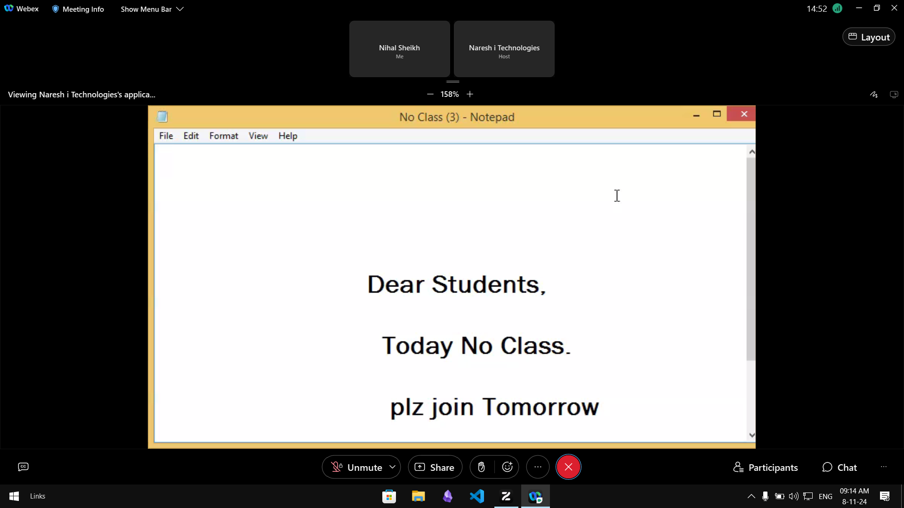

# C PROGRAMMING LANGAUGE

## INTRODUCTION

- Creator: Dennis Ritchie
- Place: Bell Labs
- Year: 1969 - 1973

## TIMELINE

| YEAR | EVENT |
| --- | --- |
| 1969 - 1973 | **C** was developed |
| 1978 | The first edition of C Programming Language also known as **K&R C** |
| 1989 | *ANSI (American National Standards Institute)* standardized C also known as **C89** |
| 1999 | C99 - Susequent revisions |
| 2011 | C11 - New features and improvements done |

## ABOUT

- Influence: C is derived from earlier langauges BCPL and B, which were used for System Programing
- UNIX Development: Initially C was created to develop the UNIX OS.
- Became popular due to its efficiency and flexibility

## APPLICATIONS

- **OS**: UNIX and its derivatives are written in C
- **Embedded System**: C is used to developing firmware and microcontroller applications
- **Compiler Development**
- **Game Engines**
- **Graphics and GUI development**: Libraries like OpenGL and GTK are used with C to developGraphics application and Graphical User Interfaces
- **DBMS**: Database Management Systems like MySQL are written in C

